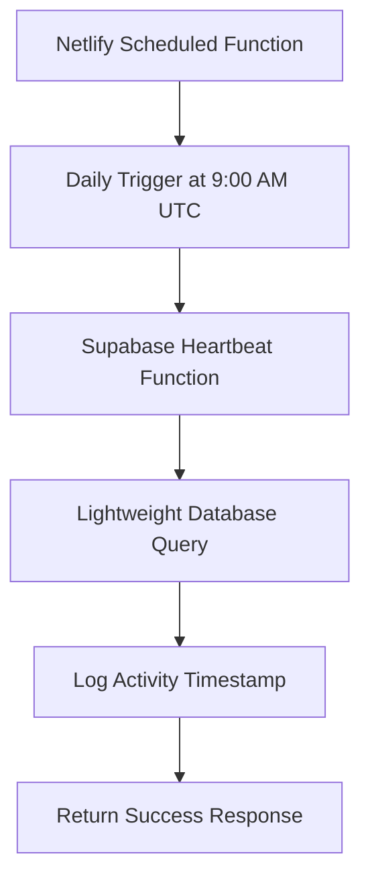
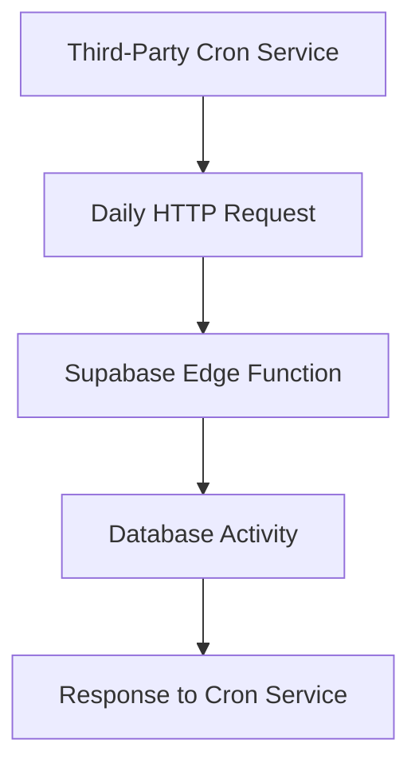
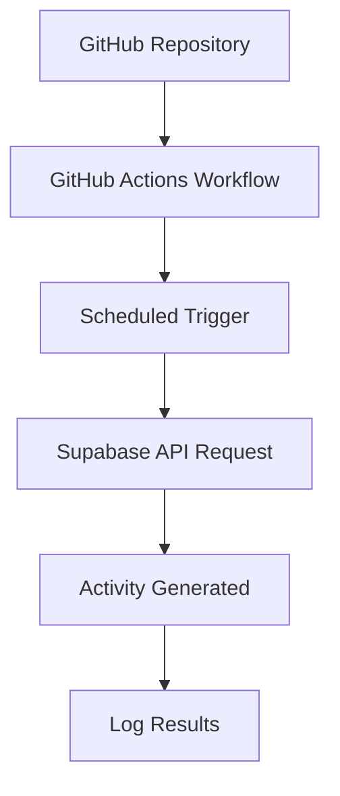

# Supabase Free Tier Activity Heartbeat Solution

## Executive Summary

This document provides a comprehensive solution to prevent a Supabase project on the free tier from being automatically paused due to inactivity. The solution implements an automated "heartbeat" system that performs minimal qualifying activities to keep the project active.

## Understanding Supabase Free Tier Inactivity Policies

### What Constitutes Qualifying Activity?

Based on Supabase's documentation and community feedback, the following activities reset the inactivity timer:

1. **Database Operations** (Read or Write):
   - Any API request to the Supabase REST API
   - Database queries (SELECT, INSERT, UPDATE, DELETE)
   - Stored procedure executions
   - Edge Function invocations that interact with the database

2. **Auth Operations**:
   - User authentication requests
   - Token refresh operations
   - User registration/sign-in

3. **Storage Operations**:
   - File uploads/downloads
   - Bucket operations

**Important Note**: Both read-only operations (like `SELECT` queries) and write operations qualify as activity. The key is that there must be an actual API request to Supabase services.

### Inactivity Timer Details

- **Free Tier**: Projects are paused after **7 days** of inactivity
- **Pro Tier**: No inactivity timeout
- **Timer Reset**: Any qualifying activity resets the 7-day counter
- **Grace Period**: Once paused, projects remain dormant until manually reactivated

## Three Implementation Strategies

### Strategy 1: Netlify Scheduled Functions (Recommended for Your Setup)

Since you're already using Netlify, this approach integrates seamlessly with your existing infrastructure.

#### Architecture Overview



#### Implementation Steps

1. **Create the Netlify Function**
2. **Configure the Schedule**
3. **Set Up Environment Variables**
4. **Deploy and Test**

#### Code Implementation

```typescript
// netlify/functions/supabase-heartbeat.ts
import { createClient } from '@supabase/supabase-js';

const supabaseUrl = process.env.SUPABASE_URL;
const supabaseAnonKey = process.env.SUPABASE_ANON_KEY;

if (!supabaseUrl || !supabaseAnonKey) {
  throw new Error('Missing Supabase environment variables');
}

const supabase = createClient(supabaseUrl, supabaseAnonKey);

export const handler = async (event, context) => {
  try {
    console.log('Starting Supabase heartbeat at:', new Date().toISOString());
    
    // Perform a lightweight query to generate activity
    const { data, error } = await supabase
      .from('settings')
      .select('updated_at')
      .limit(1)
      .single();
    
    if (error && error.code !== 'PGRST116') { // Ignore "not found" errors
      console.error('Heartbeat query failed:', error);
      return {
        statusCode: 500,
        body: JSON.stringify({ 
          success: false, 
          error: error.message,
          timestamp: new Date().toISOString()
        })
      };
    }
    
    // Optional: Log the heartbeat activity to a dedicated table
    await supabase
      .from('heartbeat_logs')
      .insert({
        executed_at: new Date().toISOString(),
        status: 'success'
      });
    
    console.log('Heartbeat completed successfully');
    
    return {
      statusCode: 200,
      body: JSON.stringify({ 
        success: true,
        message: 'Supabase heartbeat executed successfully',
        timestamp: new Date().toISOString(),
        lastActivity: data?.updated_at
      })
    };
    
  } catch (error) {
    console.error('Heartbeat function error:', error);
    return {
      statusCode: 500,
      body: JSON.stringify({ 
        success: false, 
        error: error.message,
        timestamp: new Date().toISOString()
      })
    };
  }
};
```

#### Netlify Configuration

```toml
# netlify.toml (add to your existing configuration)

[[scheduled_functions]]
  function = "supabase-heartbeat"
  schedule = "0 9 * * *"  # Daily at 9:00 AM UTC
```

#### Database Setup for Logging (Optional)

```sql
-- Create heartbeat logging table (optional but recommended)
CREATE TABLE IF NOT EXISTS heartbeat_logs (
  id uuid DEFAULT gen_random_uuid() PRIMARY KEY,
  executed_at timestamptz NOT NULL DEFAULT now(),
  status text NOT NULL,
  error_message text,
  created_at timestamptz NOT NULL DEFAULT now()
);

-- Set up RLS for the heartbeat_logs table
ALTER TABLE heartbeat_logs ENABLE ROW LEVEL SECURITY;

-- Allow anonymous inserts (for the heartbeat function)
CREATE POLICY "Allow anonymous heartbeat logs" ON heartbeat_logs
  FOR INSERT WITH CHECK (true);

-- Allow authenticated users to view logs
CREATE POLICY "Allow authenticated users to view heartbeat logs" ON heartbeat_logs
  FOR SELECT USING (auth.role() = 'authenticated');
```

#### Environment Variables Setup

In your Netlify dashboard, add these environment variables:

```
SUPABASE_URL=your_supabase_project_url
SUPABASE_ANON_KEY=your_supabase_anon_key
```

### Strategy 2: Third-Party Cron Service

This approach uses an external cron service to make HTTP requests to a Supabase Edge Function.

#### Architecture Overview



#### Implementation Steps

1. **Create Supabase Edge Function**
2. **Set Up Third-Party Cron Service**
3. **Configure Webhook/HTTP Request**
4. **Monitor and Test**

#### Supabase Edge Function Code

```typescript
// supabase/functions/heartbeat/index.ts
import { corsHeaders } from '../_shared/cors';

Deno.serve(async (req: Request) => {
  if (req.method === 'OPTIONS') {
    return new Response(null, { status: 200, headers: corsHeaders });
  }

  try {
    console.log('Heartbeat triggered at:', new Date().toISOString());
    
    // Perform a lightweight database operation
    const { data, error } = await supabase
      .from('settings')
      .select('id')
      .limit(1);
    
    if (error) {
      console.error('Heartbeat error:', error);
      return new Response(
        JSON.stringify({ 
          success: false, 
          error: error.message,
          timestamp: new Date().toISOString()
        }),
        {
          status: 500,
          headers: { 'Content-Type': 'application/json', ...corsHeaders }
        }
      );
    }
    
    return new Response(
      JSON.stringify({ 
        success: true,
        message: 'Heartbeat successful',
        timestamp: new Date().toISOString(),
        data: data
      }),
      {
        status: 200,
        headers: { 'Content-Type': 'application/json', ...corsHeaders }
      }
    );
    
  } catch (error) {
    console.error('Unexpected error:', error);
    return new Response(
      JSON.stringify({ 
        success: false, 
        error: error.message,
        timestamp: new Date().toISOString()
      }),
      {
        status: 500,
        headers: { 'Content-Type': 'application/json', ...corsHeaders }
      }
    );
  }
});
```

#### Third-Party Cron Service Options

1. **Cron-job.org** (Free tier available)
2. **EasyCron** (Free tier with limitations)
3. **UptimeRobot** (Free monitoring service)
4. **Healthchecks.io** (Free tier available)

Example configuration for Cron-job.org:
- URL: `https://your-project-ref.supabase.co/functions/v1/heartbeat`
- Method: `GET`
- Schedule: `0 9 * * *` (Daily at 9:00 AM UTC)

### Strategy 3: GitHub Actions

This approach uses GitHub Actions to schedule and execute the heartbeat function.

#### Architecture Overview



#### GitHub Actions Workflow

```yaml
# .github/workflows/supabase-heartbeat.yml
name: Supabase Heartbeat

on:
  schedule:
    # Run daily at 9:00 AM UTC
    - cron: '0 9 * * *'
  workflow_dispatch: # Allow manual triggering

jobs:
  heartbeat:
    runs-on: ubuntu-latest
    
    steps:
    - name: Execute Supabase Heartbeat
      run: |
        curl -X POST \
          '${{ secrets.SUPABASE_URL }}/rest/v1/settings?select=id' \
          -H "apikey: ${{ secrets.SUPABASE_ANON_KEY }}" \
          -H "Authorization: Bearer ${{ secrets.SUPABASE_ANON_KEY }}" \
          -H "Content-Type: application/json" \
          -d '{}'
      
    - name: Log Heartbeat Result
      run: |
        echo "Heartbeat executed at $(date -u)"
        
    - name: Notify on Failure
      if: failure()
      run: |
        echo "Supabase heartbeat failed at $(date -u)"
```

#### Required GitHub Secrets

In your GitHub repository settings, add these secrets:

```
SUPABASE_URL=https://your-project-ref.supabase.co
SUPABASE_ANON_KEY=your_supabase_anon_key
```

## Comparison of Approaches

| Aspect | Netlify Functions | Third-Party Cron | GitHub Actions |
|--------|------------------|------------------|----------------|
| **Setup Complexity** | Low (already using Netlify) | Medium | Medium |
| **Reliability** | High | Medium | High |
| **Cost** | Free (within Netlify limits) | Free tier available | Free (within GitHub limits) |
| **Security** | Excellent (uses Netlify env vars) | Good (depends on service) | Excellent (GitHub Secrets) |
| **Monitoring** | Built-in Netlify logs | Varies by service | GitHub Actions logs |
| **Maintenance** | Low | Medium | Low |
| **Integration** | Seamless with existing setup | External dependency | Good for DevOps workflows |

## Security Considerations

### API Key Management

1. **Never expose service role keys** in automated systems
2. **Use anon keys** for read-only operations
3. **Store keys securely** in environment variables or secrets
4. **Rotate keys periodically** as a security best practice

### Access Control

1. **Implement Row Level Security (RLS)** on all tables
2. **Create specific policies** for automated operations
3. **Limit permissions** to only what's necessary for the heartbeat
4. **Audit logs** to monitor automated activities

## Final Recommendation

Given that you're already using Netlify for hosting, **Strategy 1 (Netlify Scheduled Functions)** is the most pragmatic and maintainable solution for your use case.

### Why This is the Best Choice:

1. **Seamless Integration**: Works within your existing infrastructure
2. **Unified Management**: Single platform for both hosting and scheduling
3. **Excellent Security**: Netlify's environment variable management
4. **Built-in Monitoring**: Netlify provides logs and error tracking
5. **Low Maintenance**: No external dependencies to manage
6. **Cost-Effective**: Free within Netlify's generous limits

### Implementation Priority:

1. **Immediate**: Implement Netlify Scheduled Function with daily heartbeat
2. **Optional**: Add heartbeat logging table for monitoring
3. **Future**: Consider GitHub Actions as backup/failover

## Implementation Timeline

| Day | Task |
|-----|------|
| Day 1 | Create heartbeat function and test locally |
| Day 2 | Deploy to Netlify and configure schedule |
| Day 3 | Set up logging table and monitoring |
| Day 4 | Test end-to-end and verify activity generation |
| Day 5 | Document and handoff to production |

## Monitoring and Maintenance

### Monitoring Checklist

- [ ] Check Netlify function logs daily for first week
- [ ] Verify heartbeat logs in database (if implemented)
- [ ] Monitor Supabase dashboard for activity indicators
- [ ] Set up alerts for function failures

### Maintenance Tasks

- **Monthly**: Review function logs and performance
- **Quarterly**: Verify Supabase project remains active
- **As Needed**: Update function if Supabase API changes

## Troubleshooting Guide

### Common Issues

1. **Function Not Triggering**
   - Verify schedule syntax in netlify.toml
   - Check Netlify function logs
   - Ensure function is properly deployed

2. **Authentication Errors**
   - Verify environment variables are set
   - Check Supabase URL and API key validity
   - Ensure anon key permissions are sufficient

3. **Database Query Failures**
   - Verify table exists and is accessible
   - Check RLS policies
   - Review Supabase logs for detailed errors

### Emergency Procedures

If the heartbeat fails:
1. **Manual Activation**: Access Supabase dashboard to reactivate project
2. **Fallback**: Use GitHub Actions workflow as backup
3. **Temporary Fix**: Manual database query via dashboard

## Conclusion

Implementing a Supabase heartbeat solution is straightforward and essential for free-tier projects. The Netlify Scheduled Functions approach provides the most reliable and maintainable solution for your specific setup, ensuring your project remains active without requiring manual intervention.

By following this implementation guide, you'll have a robust, automated system that keeps your Supabase project active while maintaining security best practices and providing visibility into the heartbeat operations.